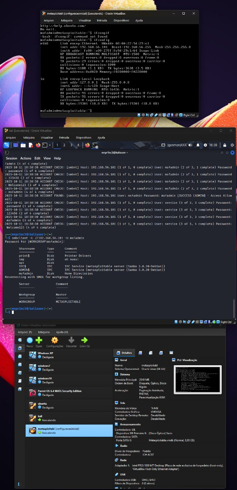
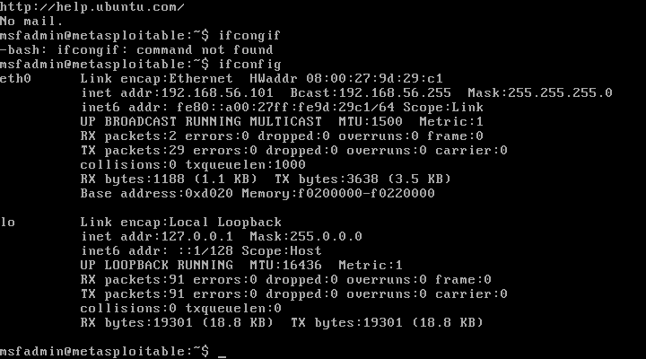
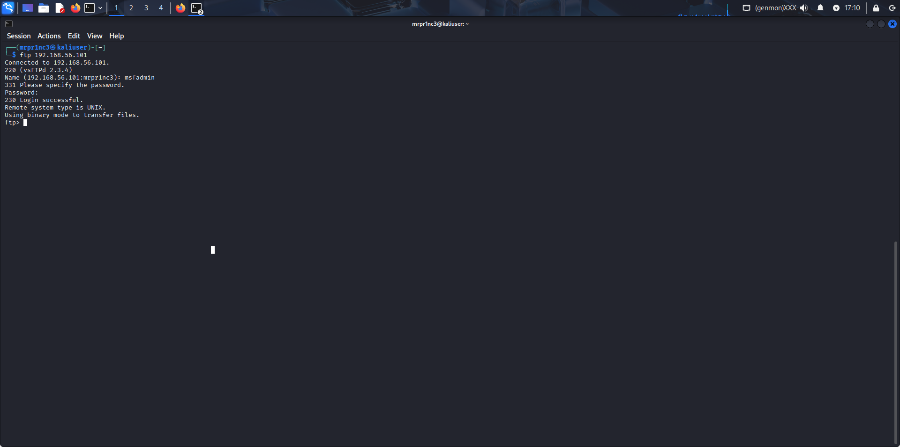
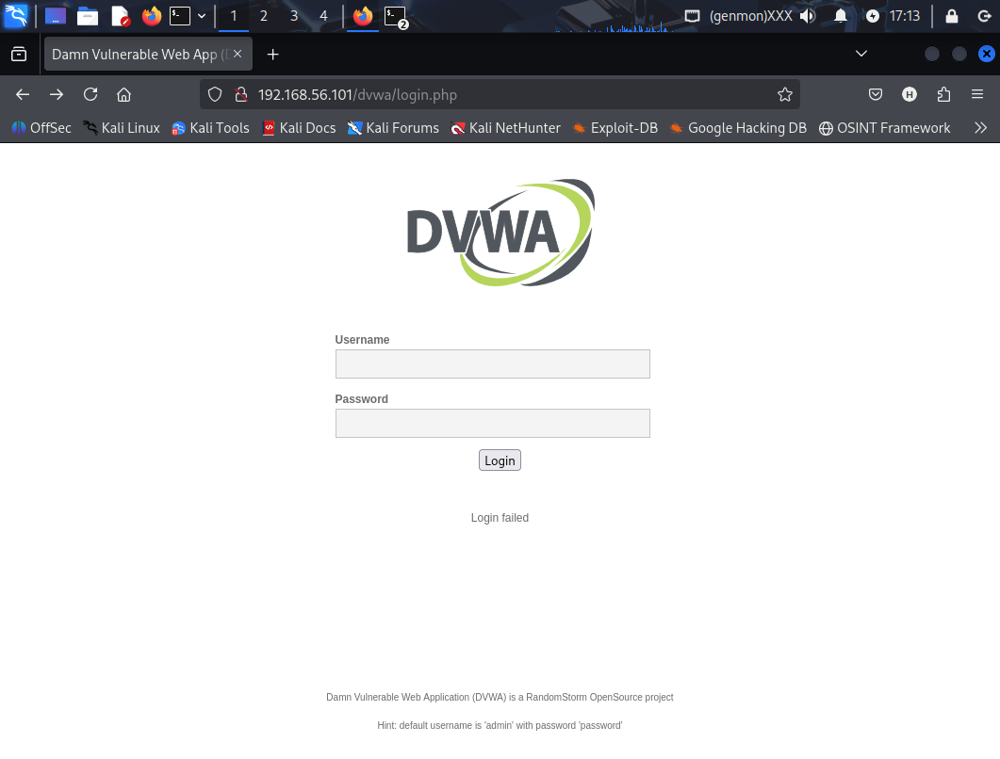
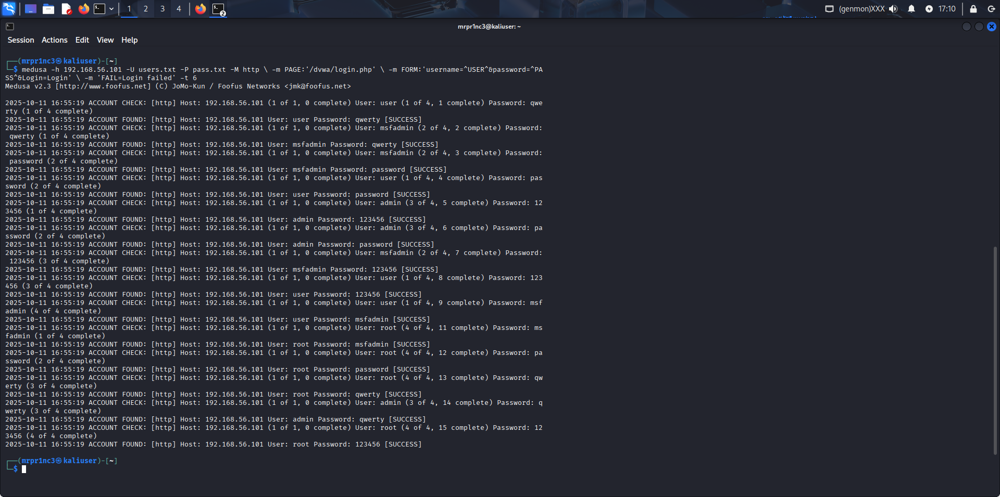
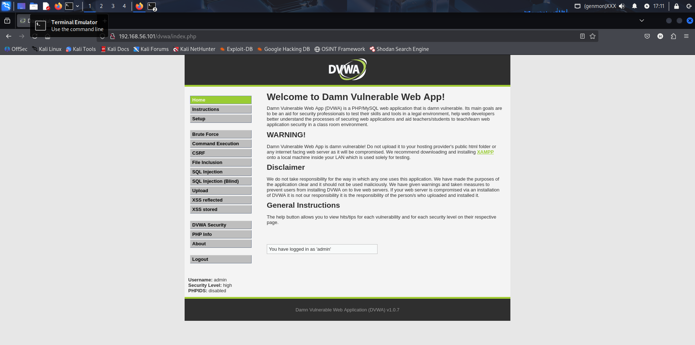
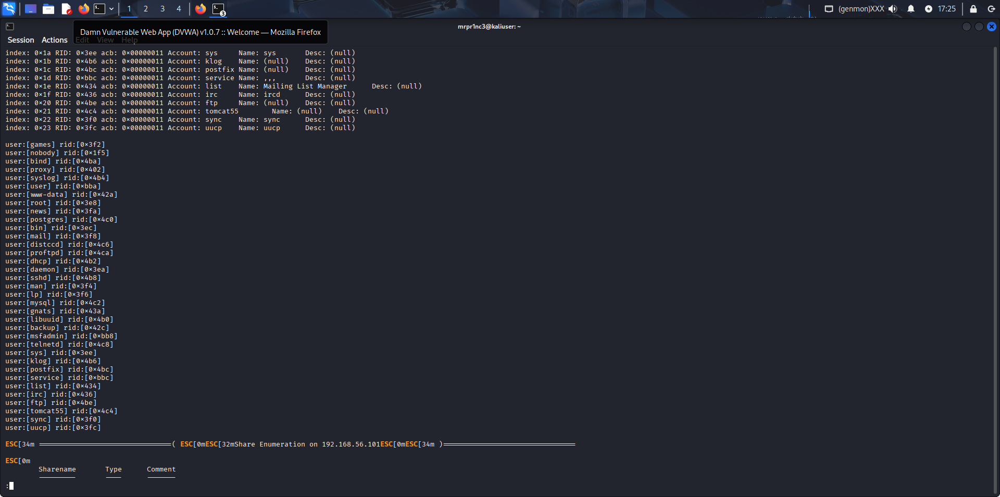
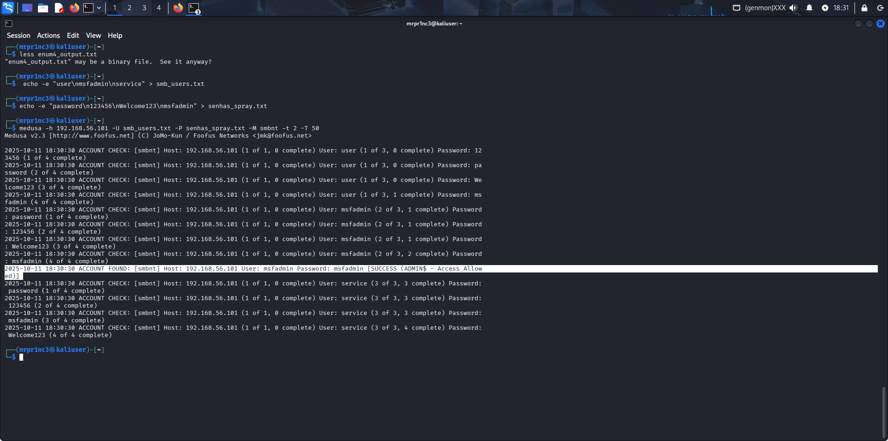
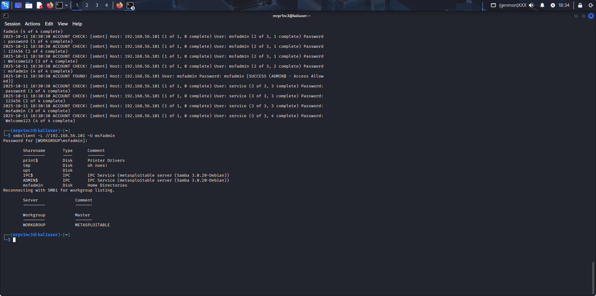

# simulando-ataque-brute-force-medusa
Simulando um Ataque de Brute Force de Senhas com Medusa e Kali Linux

 

Ambiente Virtual controlado (host-only)

 

IP metasploitable (maquina vulneravel)

 

Conexao ftp com a maquina

 

Login http DVWA

 

Ataque de brute force com medusa ao formulario login DVWA no protocolo http

 

Ataque bem sucedido ao login DVWA

 

Enumeracao em um ambiente corporativo mal configurado

 

Encontrando usuarios vulneraveis

 

Ataque de brute force com medusa ao protocolo smbclient

 

Ataque ao smbclient bem sucedido
